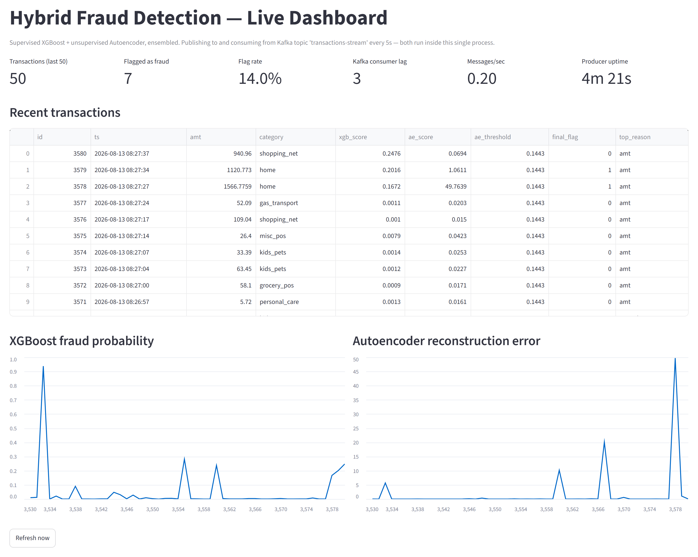

# 🛡️ Fraud-Advanced-Pipeline: Real-Time Fraud & Anomaly Detection System

A hybrid fraud-detection system combining **supervised machine learning** and **unsupervised deep learning** to monitor, flag, and analyze transaction fraud in real time. Transactions are streamed continuously through **Apache Kafka**, scored by the hybrid model, and written to a persistent Postgres audit trail with SHAP-based explanations, all surfaced on a live Streamlit dashboard.

**🔴 Live demo:** [fraud-advanced-pipeline-g9cyyctvbksdop7udrlyht.streamlit.app](https://fraud-advanced-pipeline-g9cyyctvbksdop7udrlyht.streamlit.app/)

> ### ⚙️ Two ingestion modes — and which one the live demo runs
>
> `app.py` picks its ingestion path automatically at startup:
>
> | Mode | When | What happens |
> | :--- | :--- | :--- |
> | **Kafka streaming** | a broker is reachable | A background thread publishes to the `transactions-stream` topic; a scheduler consumes it back |
> | **In-process** | no broker reachable | The same simulation logic runs inline and hands transactions straight to the scorer |
>
> **The public live demo runs in-process mode.** Kafka requires a running broker, and there is no
> permanently-free hosted Kafka (Confluent's credits expire, Upstash and CloudKarafka discontinued
> their free Kafka tiers). Rather than let the demo die when a trial lapses — or ship a page that
> silently never receives a transaction — the app degrades to in-process generation, and **says so in
> the dashboard itself**, so it is never ambiguous which path is live.
>
> Everything after ingestion — feature engineering, hybrid scoring, SHAP, Postgres — is byte-identical
> in both modes. To see the real Kafka path, run it locally: `docker compose up -d && streamlit run
> app.py`. See [Real-Time Streaming Architecture](#-real-time-streaming-architecture-kafka).

---

## 📈 Dashboard Preview



*Live capture of the running app: transactions arriving over Kafka, scored, and persisted. The top row
shows the model metrics (volume, flags, flag rate) alongside the three **stream-health** metrics —
Kafka consumer lag, messages/sec, and producer uptime. The spikes in the charts are injected anomalies
being caught: note row `3578` (amt 1566.78) with an autoencoder reconstruction error of **49.76**
against a threshold of **0.1443** — flagged by the unsupervised half of the ensemble even though
XGBoost scored it only 0.1672.*

---

## 🤖 Why These Algorithms Are Used

This pipeline utilizes a **hybrid ensemble architecture** combining two distinct models to build a defense-in-depth security layer:

### 1. Supervised Learning: XGBoost
* **Why**: XGBoost (Extreme Gradient Boosting) is the gold standard for tabular data classification. It builds decision trees sequentially to minimize a loss function.
* **Role**: It excels at recognizing **known signatures of fraud** that exist in historical training data (e.g., specific transaction categories paired with high values or specific hours).
* **Training Detail**: The training data features a severe class imbalance (<1% fraud transactions). During training, **SMOTE** (Synthetic Minority Over-sampling Technique) is applied to balance the classes and allow the model to learn fraud boundaries effectively.

### 2. Unsupervised Learning: Deep Autoencoder
* **Why**: Fraud patterns constantly evolve. A supervised model alone cannot flag a fraud technique it has never seen before.
* **Role**: The Autoencoder (a Neural Network implemented in TensorFlow/Keras) acts as an **anomaly detector** to flag **unseen/novel fraud patterns**.
* **Training Detail**: The network is trained *only* on legitimate (non-fraudulent) transactions. It learns to compress transaction features into a low-dimensional bottleneck and reconstruct them.
  * When a **normal** transaction is input, the model reconstructs it with high accuracy (low Reconstruction Error).
  * When an **anomalous** transaction is input (e.g., highly unusual amount, distant location, odd hour), the model fails to reconstruct it accurately (high Reconstruction Error).
  * If the reconstruction error (MSE) exceeds a pre-calibrated threshold, the transaction is flagged as an anomaly.

### 3. Hybrid Decision Logic
The final flag is triggered if **either** model flags the transaction:
$$\text{Final Flag} = \text{XGBoost Flag (Probability } > 0.5) \lor \text{Autoencoder Anomaly (Error } > \text{Threshold)}$$
This captures both highly typical fraud profiles and completely new types of anomalies.

---

## 📁 File Structure

```text
Fraud LLM/
├── data/
│   ├── fraudTrain.csv            # [LOCAL ONLY] Kaggle Training Set (~351 MB) Link: https://www.kaggle.com/datasets/kartik2112/fraud-detection
│   └── fraudTest.csv             # [LOCAL ONLY] Kaggle Test Set (~150 MB)
├── .streamlit/
│   └── secrets.toml              # [LOCAL ONLY, gitignored] Neon Postgres connection string
├── .github/
│   └── workflows/
│       └── keep_alive.yml        # Pings the live app every 6h to prevent Streamlit Cloud sleep
├── .gitignore                    # Prevents large data files and secrets from being tracked
├── README.md                     # Project documentation (this file)
├── requirements.txt              # Project library dependencies
├── docker-compose.yml            # Local single-broker Kafka (KRaft mode, no Zookeeper)
├── features.py                   # Shared feature engineering pipeline (avoids train/serve skew)
├── train_model.py                # Model training, threshold calibration & artifact serialization
├── generate_reference_sample.py  # Utility to build lightweight simulation reference sample
├── producer.py                   # Standalone process: publishes simulated live transactions to Kafka
├── app.py                        # Streamlit dashboard: Kafka consumer, scheduler, and inference logic
├── streamlit_realtime.png        # Real-time screenshot of running Streamlit app
├── xgb_model.pkl                 # [Generated] Trained XGBoost classifier
├── autoencoder_model.keras       # [Generated] Trained Keras Autoencoder model
├── scaler.pkl                    # [Generated] StandardScaler for normalizing numeric features
├── ae_threshold.pkl              # [Generated] Calibrated anomaly threshold (Float)
├── feature_columns.pkl           # [Generated] List of feature columns for schema alignment
├── category_maps.pkl             # [Generated] Frequency maps for high-cardinality columns
└── reference_sample.pkl          # [Generated] 5,000 genuine transactions, resampled by producer.py
```

> **Note:** live transaction data is *not* stored in this repo or on local disk. It's persisted in a
> [Neon](https://neon.tech) Postgres database (serverless, free tier), configured via the
> `DATABASE_URL` secret — see [Deploying with a hosted Kafka broker](#deploying-with-a-hosted-kafka-broker-confluent-cloud) below.

---

## ⚙️ Generated Files & Their Purpose

To run the Streamlit app (`app.py`), the model training script (`train_model.py`) generates several files. These files bridge the training phase to the real-time inference phase:

| Generated File | Type | Why It Is Generated & What It Does |
| :--- | :--- | :--- |
| **`xgb_model.pkl`** | Joblib Serialized Model | Stores the trained XGBoost model parameters so we can run instant predictions in `app.py` without retraining. |
| **`autoencoder_model.keras`** | TensorFlow H5/Keras Model | Stores the neural network weights and structure of the Autoencoder. Loaded by TensorFlow in `app.py` to calculate reconstruction errors. |
| **`scaler.pkl`** | Joblib Serialized Scaler | Contains the mean and variance computed by `StandardScaler` during training. This ensures live inference data is scaled **exactly** like the training data. |
| **`ae_threshold.pkl`** | Joblib Serialized Float | Stores the anomaly boundary (the **95th percentile** of legitimate-transaction reconstruction errors, computed in `train_model.py`). Any live transaction with an error exceeding this is flagged. |
| **`feature_columns.pkl`** | Joblib Serialized List | Lists the exact column names and order of the model's feature set. Used to align incoming data formats and prevent schema errors. |
| **`category_maps.pkl`** | Joblib Serialized Dictionary | Contains frequency mapping percentages for high-cardinality fields (like ZIP codes or Jobs) so they can be represented numerically at inference time. |
| **`reference_sample.pkl`** | Joblib Serialized DataFrame | Contains a subset of 5,000 real, legitimate transactions (including their original timestamps). `producer.py` samples from this to publish realistic live transactions to Kafka that preserve real feature correlations, rather than generating noisy random synthetic values. |

**Live transaction storage:** every scored transaction, its model scores, and its final flag are written to a **Neon Postgres** database rather than a local file. This means the audit trail persists across app restarts and redeploys — a local SQLite file would not survive Streamlit Community Cloud's ephemeral filesystem.

---

## 🔌 Real-Time Streaming Architecture (Kafka)

Transactions travel through a real message broker instead of being generated in-process:

```text
app.py's producer thread --> Kafka topic 'transactions-stream' --> app.py's KafkaConsumer
                                                                          |
                                                                          v
                                                      features.py (train/serve-consistent
                                                      feature engineering)
                                                                          |
                                                                          v
                                                XGBoost + Autoencoder hybrid scoring + SHAP
                                                                          |
                                                                          v
                                                    Neon Postgres  -->  Streamlit dashboard
```

- **The producer runs inside `app.py`** as a daemon thread (`start_producer_thread()`, cached with
  `@st.cache_resource` so it starts exactly once per process, same reasoning as the scheduler below).
  Every 5 seconds it resamples a row from `reference_sample.pkl` (~8% of the time perturbed into a
  believable outlier — see [Realistic Simulation](#-real-world-application--value)), stamps it with
  the thread's own start time, and publishes it as JSON to the `transactions-stream` Kafka topic. This
  is what makes a single Streamlit deployment self-sufficient — no second always-on process needed.
  `producer.py` still exists as a **standalone** copy of the same logic, but it is **not required** —
  `app.py` always runs its own producer, so launching `producer.py` at the same time just adds a
  second publisher to the same topic (roughly doubling the transaction rate). That's only useful as an
  extra load generator, not as a normal way to run the project.
- **The consumer**, also in `app.py`, runs a `KafkaConsumer` (consumer group `fraud-dashboard-consumer`)
  inside an APScheduler background job that polls the topic every 5 seconds, drains whatever's new,
  and scores each message through the hybrid pipeline.
- **Broker connection** is resolved by `_kafka_connection_kwargs()`: if `KAFKA_BOOTSTRAP_SERVERS` is
  set in secrets, that's used (with `SASL_SSL`/`PLAIN` auth automatically added whenever
  `KAFKA_API_KEY` is also present — e.g. Confluent Cloud); otherwise it falls back to local Docker
  Kafka on `localhost:9092` with no auth. Same code, no branching needed by hand.
- **`docker-compose.yml`** brings up a single-broker Kafka cluster in **KRaft mode** (no Zookeeper) for
  local dev. Because it's single-broker, `KAFKA_OFFSETS_TOPIC_REPLICATION_FACTOR` and the
  transaction-state-log equivalents are explicitly pinned to `1` — Kafka's internal `__consumer_offsets`
  topic defaults to a replication factor of 3, which can never be satisfied with one broker, and if left
  at the default no consumer group can ever be assigned a partition (this was the actual root cause of
  an extended "nothing is arriving" bug during development — the fix is small but easy to miss). A
  hosted broker like Confluent Cloud handles this itself; it only matters for the local Docker setup.
- **Dashboard stream-health metrics**: alongside the transaction table, the dashboard shows Kafka
  consumer lag (unread messages across all partitions, via a dedicated short-lived `KafkaAdminClient`
  lookup — kept separate from the inference consumer since `KafkaConsumer` instances aren't
  thread-safe), a rolling messages/sec rate computed from local receive timestamps, and producer
  uptime derived from the start time carried on each message.

### Running locally
One process — the same thing that runs when deployed:
```bash
docker compose up -d      # Kafka broker (or set KAFKA_BOOTSTRAP_SERVERS etc. in secrets.toml
                           # to point at a hosted broker instead, and skip this)
streamlit run app.py      # publishes, consumes, scores, stores, renders -- all in one process
```
The topic is auto-created on first publish — no manual `kafka-topics.sh --create` step needed for
local Docker Kafka's default single-partition config.

Optionally, `python producer.py` in a second terminal adds another publisher on top (doubling the
rate) if you want to see the dashboard under heavier load. It's not part of normal operation.

**If the broker isn't reachable**, the dashboard still renders rather than crashing: consumer lag
displays `-1`, the transaction table shows whatever history is already in Postgres, and both the
producer thread and the consumer poll retry every 5s. They reconnect on their own once the broker
comes back — no app restart needed. (Verified by stopping the broker mid-run and restarting it.)

---

## 🚀 Usage & Deployment

### 1. Installation
Clone the repository and install the dependencies:
```bash
pip install -r requirements.txt
```

### 2. Model Training (Optional)
If you wish to retrain the models:
1. Download the Kaggle **Fraud Detection Dataset** (kartik2112/fraud-detection).
2. Create a folder named `data/` and place `fraudTrain.csv` and `fraudTest.csv` inside it.
3. Run the training script:
   ```bash
   python train_model.py
   ```
This will fit the models and regenerate the `.pkl` and `.keras` files.

### 3. Generate Reference Sample
If you need to regenerate the reference sample used by the simulator from the dataset:
```bash
python generate_reference_sample.py
```

### 4. Configure Secrets (local run)
Create `.streamlit/secrets.toml` (gitignored, never commit this) with your own Postgres connection string:
```toml
DATABASE_URL = "postgresql://<user>:<password>@<host>/<dbname>?sslmode=require"
```
[Neon](https://neon.tech) offers a permanent free tier (no credit card) that works well here — use the
**pooled** connection string (hostname containing `-pooler`), since the app opens many short-lived
connections rather than one long-lived one. `KAFKA_BOOTSTRAP_SERVERS` / `KAFKA_API_KEY` /
`KAFKA_API_SECRET` are optional additions to the same file — see the next section — and only needed if
you're pointing at a hosted broker instead of local Docker Kafka.

### 5. Running Locally
Requires Docker Desktop (or another Docker engine) unless you're pointing at a hosted broker instead.
See [Real-Time Streaming Architecture](#-real-time-streaming-architecture-kafka) above for the full
picture; in short:
```bash
docker compose up -d      # Kafka broker
streamlit run app.py      # publishes, consumes, scores, stores, renders -- one process
```

### 6. (Optional) Deploying with a hosted Kafka broker
**Not required — and deliberately not done for the live demo.** `localhost:9092` isn't reachable from
Streamlit Community Cloud, so running the *Kafka* path in the cloud needs an internet-facing broker.
[Confluent Cloud](https://confluent.cloud) is the usual choice, but its free credits **expire** (~30
days) after which a Basic cluster costs roughly $1/day. Since the whole point of the deployed link is
to stay up indefinitely at zero cost, the deployment runs the in-process fallback instead.

If you do want the live deployment on real Kafka, these are the steps. Steps 1-2 and 5 happen in your
browser / GitHub:

1. **Create the cluster.** Sign up at confluent.cloud, create a new cluster (**Basic** type, cheapest
   region). This replaces local Docker Kafka for anything deployed.
2. **Create the topic and an API key.** Inside the cluster, create a topic named exactly
   `transactions-stream` (matches `KAFKA_TOPIC` in `app.py` — no code changes needed if you use this
   name). Under **API Keys**, create a key/secret pair scoped to this cluster; save both. Copy the
   **Bootstrap server** URL from cluster settings too (looks like
   `pkc-xxxxx.region.aws.confluent.cloud:9092`).
3. **Add secrets locally**, in `.streamlit/secrets.toml` (see the commented-out template already in
   that file):
   ```toml
   KAFKA_BOOTSTRAP_SERVERS = "pkc-xxxxx.region.aws.confluent.cloud:9092"
   KAFKA_API_KEY = "your-api-key"
   KAFKA_API_SECRET = "your-api-secret"
   ```
   `app.py` picks these up automatically via `_kafka_connection_kwargs()` and switches to `SASL_SSL`
   auth — no other code changes needed. Run `streamlit run app.py` locally against the real cloud
   broker to confirm it works before deploying (no `docker compose up -d` needed once these are set).
4. **Push to GitHub.** `app.py`, `features.py`, `requirements.txt`, `docker-compose.yml`, and the model
   artifact files (`xgb_model.pkl`, `autoencoder_model.keras`, etc.) all need to be committed.
   `producer.py` can stay too, for local dev — it's just not required for deployment. **Never commit
   `secrets.toml`** — confirm it's still listed in `.gitignore` first.
5. **Deploy on [share.streamlit.io](https://share.streamlit.io).** Connect the GitHub repo, point it at
   `app.py`. Under the app's **Settings → Secrets**, paste in `DATABASE_URL`,
   `KAFKA_BOOTSTRAP_SERVERS`, `KAFKA_API_KEY`, and `KAFKA_API_SECRET` — same values as local
   `secrets.toml`. Redeploy if the app already tried (and failed) to start before secrets were added.

### 7. Current Live Deployment
The public live demo runs `app.py` in **in-process mode** — same code, same models, same Postgres
audit trail, with the Kafka hop skipped because no broker is attached (see the mode table at the top
of this README). The dashboard displays which mode is active.

**🔴 [fraud-advanced-pipeline-g9cyyctvbksdop7udrlyht.streamlit.app](https://fraud-advanced-pipeline-g9cyyctvbksdop7udrlyht.streamlit.app/)**

- Secrets (`DATABASE_URL`) are configured in Streamlit Cloud's own Secrets manager, never committed to the repo.
- Streamlit Community Cloud's free tier sleeps an app after 12 hours with no traffic. A scheduled
  GitHub Actions workflow (`.github/workflows/keep_alive.yml`) pings the live URL every 6 hours to
  keep it awake, using an `APP_URL` repository secret.

> **Architecture note:** this project was originally scoped for Hugging Face Spaces (Docker), but
> Hugging Face moved Docker/Gradio Spaces behind a paid Pro plan for new free accounts. The project
> was migrated to Streamlit Community Cloud + Neon Postgres instead — both genuinely free, permanent
> tiers with no credit card required.

---

## 💼 Real-World Application & Value

This hybrid architecture represents a production-grade approach to fraud risk management:

* **Train/Serve Skew Prevention**: By importing `features.py` inside both `train_model.py` and `app.py`, the exact same feature extraction transformations (distance calculation, frequency encoding, dummy categorization) are applied, eliminating a common cause of model decay in production.
* **Explainable AI (XAI)**: Includes **SHAP (SHapley Additive exPlanations)** values integrated directly into the dashboard alerts, showing investigators the exact top contributors (e.g., amount, location distance, category) that led XGBoost to flag a transaction.
* **Audit Trail**: Every transaction is logged into a persistent **Neon Postgres** database, decoupled from the app's own runtime so the record survives restarts and redeploys. Real-world financial institutions rely on this kind of durable database logging for regulatory compliance (AML/CFT auditing) and retrospective analysis.
* **Realistic Simulation**: `producer.py`'s simulated "normal" transactions are resampled from real legitimate transactions (preserving genuine feature correlations, including original transaction hour) rather than generated from scratch — an earlier random-synthetic approach inflated the false-flag rate well above the intended ~8% anomaly injection rate.
